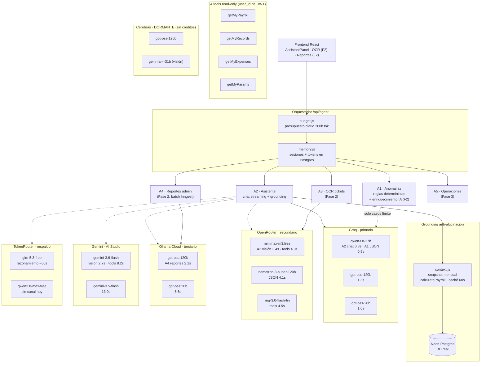

# Grafo de interconexión: Agentes ↔ Gateways ↔ Modelos

> Actualizado: 2026-08-29 · 6 gateways, 12 modelos activos, 5 en espera
> Fuente: benchmarks T1 (tools), T2 (JSON), T3 (OCR visión) — ver `PLAN_AGENTES.md`

## Diagrama general (Mermaid — renderiza en GitHub)



## Versión ASCII — flujo de decisión de la cadena

```
                        MENSAJE DEL TÉCNICO
                              │
                              ▼
              ┌───────────────────────────────┐
              │  budget → sesión → historia   │
              │  + GROUNDING (snapshot mes    │
              │    calculado por el servidor) │
              └───────────────┬───────────────┘
                              ▼
   ═══ CADENA DE MODELOS (primer modelo que responda con texto gana) ═══

   TIER 1 · GROQ            1. qwen3.8-27b        ← A2 chat (0.8s) · A1 JSON (0.5s)
                            2. gpt-oss-120b       (1.3s)
                            3. gpt-oss-20b        (1.0s)
   TIER 2 · OPENROUTER      4. minimax-m3:free    ← A3 visión (3.4s)
                            5. nemotron-3-super   (JSON 4.1s)
                            6. ling-3.0-flash-fin (4.5s)
   TIER 3 · OLLAMA          7. gpt-oss:120b       ← A4 reportes (2.1s)
                            8. gpt-oss:20b        (6.6s)
   TIER 4 · GEMINI          9. gemini-3.6-flash   ← visión 2.7s (thinking: max_tokens≥2000)
                           10. gemini-3.5-flash   (13.0s)
   TIER 5 · TOKENROUTER    11. glm-5.3-free       (razonamiento, ~60s)
                           12. qwen3.8-max-free   (sin canal hoy)
                              │
              todos fallan ▼
              ┌───────────────────────────────┐
              │ mensaje claro + reintento     │
              └───────────────────────────────┘

   ASIGNACIONES POR AGENTE (specs en .env)
   ┌─────┬────────────────────────────────┬──────────────────────────────────┐
   │ A1  │ JSON score 0-100 (F2 batch)    │ LLM_JSON_MODEL = qwen3.8-27b     │
   │ A2  │ chat streaming + tools ×4      │ cadena completa (12 modelos)     │
   │ A3  │ OCR boleta → JSON              │ vision: minimax-m3 → gemma4:31b  │
   │     │                                │ → gemini-3.6-flash (F2)          │
   │ A4  │ reporte mensual narrativo      │ LLM_REPORT_MODEL = ollama:gpt-oss:120b │
   │ A5  │ diagnóstico JSON (F3)          │ nemotron-3-super (planeado)      │
   └─────┴────────────────────────────────┴──────────────────────────────────┘

   SIN LLM (determinista, protege el dinero)
   · A1 reglas: extraHours>12/día · extras>duración turno · tope mensual 60h
   · schema zod: .max(12) · errorHandler redactado · audit_log completo
```

## Matriz agente × modelo (✅ usa · ⚪ fallback · ◻ planeado)

| Modelo | Gateway | A1 JSON | A2 Chat | A3 Visión | A4 Reporte | A5 Ops |
|---|---|---|---|---|---|---|
| qwen3.8-27b | Groq | ✅ **0.5s** | ✅ **0.8s** | — | — | — |
| gpt-oss-120b | Groq | ⚪ | ⚪ 1.3s | — | — | — |
| gpt-oss-20b | Groq | ⚪ | ⚪ 1.0s | — | — | — |
| minimax-m3:free | OpenRouter | ⚪ 5.8s | ⚪ 4.0s | ✅ **3.4s** | — | — |
| nemotron-3-super | OpenRouter | ⚪ 4.1s | ⚪ 7.2s | — | — | ◻ F3 |
| ling-3.0-flash-fin | OpenRouter | ⚪ | ⚪ 4.5s | — | — | — |
| gpt-oss:120b | Ollama | — | ⚪ 2.1s | — | ✅ **2.1s** | — |
| gpt-oss:20b | Ollama | ⚪ 8.1s | ⚪ 6.6s | — | ⚪ | — |
| gemini-3.6-flash | Gemini | ⚪ | ⚪ 8.2s | ⚪ 2.7s | — | — |
| gemini-3.5-flash | Gemini | ⚪ | ⚪ 13.0s | ⚪ 8.1s | — | — |
| glm-5.3-free | TokenRouter | — | ⚪ 60.6s | — | ⚪ (lento) | — |
| qwen3.8-max-free | TokenRouter | — | ⚪ (sin canal) | — | — | — |
| gpt-oss-120b | Cerebras ⏸ | — | ◻ | — | ◻ | — |
| gemma-4-31b | Cerebras ⏸ | — | — | ◻ (3ª visión) | — | — |
| whisper-large-v3 | Groq | — | — | — | — | ◻ voz (F3+) |

⏸ dormente (sin créditos) · F2/F3 = fase del roadmap
